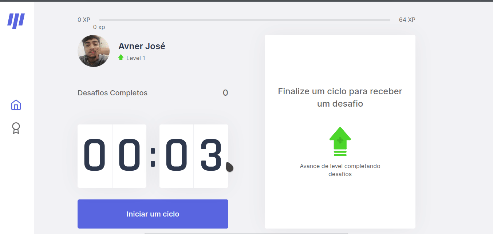

<p align="center">
   
</p>

 

This project was developed during the fourth edition of the online event called [NextLeveLWeek](https://nextlevelweek.com) ministred by [RocketSeat](https://github.com/Rocketseat)

## ⚡️ The Project
  The Moveit project was designed to make people who work in the computer to practice some simple exercíses to distract themselves in the interval between working periods.The project uses the concept of the Pomodoro technique which determines 25 minute working cycles and 5 minutes break beetween them, which alows people to keep more focused during working times. The project has a 25 minute timer that drops a new challenge when de time goes up, them you can make the proposed exercise, if you complete a challenge then you win xp that can make you go to a higher level in the aplication, if you fail, the clock simply resets and you can try again later after another 25 minute work cycle. 
  
## 🖥️ Used Tecnologies
 - [ReactJs](https://reactjs.org/)
 - [NextJs](https://nextjs.org/)
 - [Styled-Components](https://styled-components.com/)

## ⚙️ Dependencies
 - [Yarn](https://yarnpkg.com/)
 
## Getting Started

First, clone this repository: 

```bash

```

First, run the development server:

```bash
npm run dev
# or
yarn dev
```

Open [http://localhost:3000](http://localhost:3000) with your browser to see the result.
